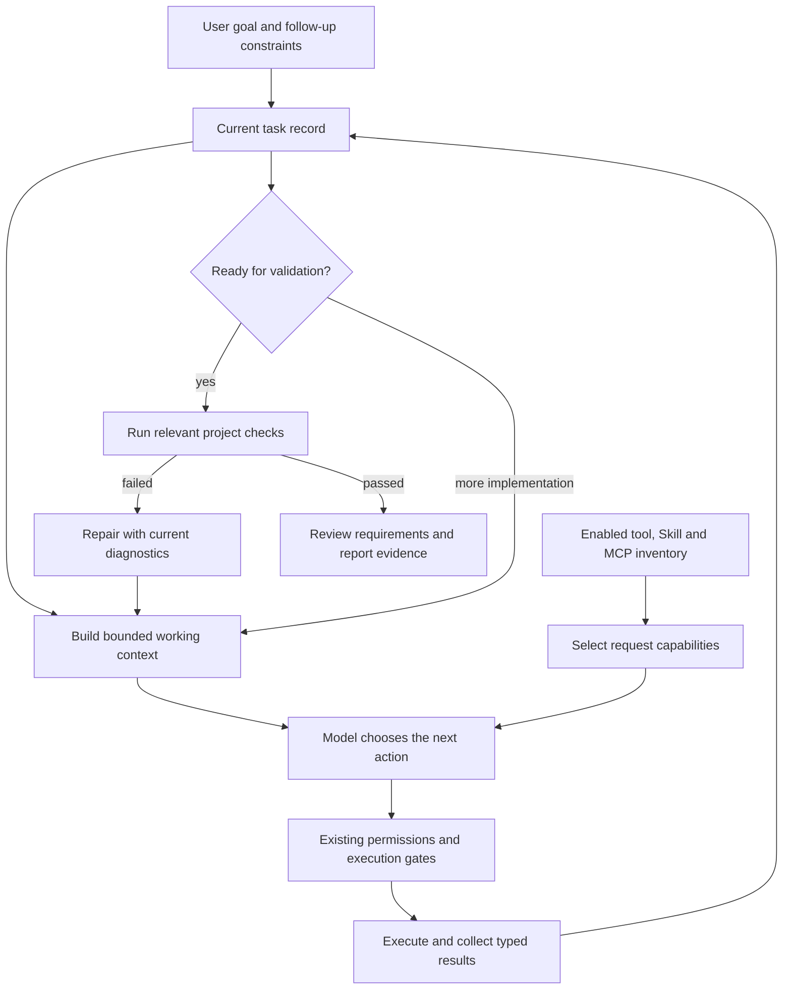

# Klaude agent orchestration improvement plan

Status: Phase 0 baseline and Phase 1 source-context/task-state slices implemented.
Real CLI/TUI comparisons identified completed-edit retention, scope movement,
notice budgeting and partial-file inspection defects; host corrections are
implemented. 4B reaches implementation and failing validation, but neither
model completes the unchanged CSV benchmark. Final-candidate GPU comparisons
await a hardware reset after CUDA failed again. Later phases have not
started. See [source-context evaluation](agent-source-context-evaluation.md) and
[task-state evaluation](agent-task-state-evaluation.md).
Prepared: 2026-10-05.
Research checkpoint: `f1523524a8f3043f2d96f6cd7f44973ea68d4f35`, pushed to `main`.

## Objective

Help Klaude complete complex projects with weaker local models by giving the
model a smaller, accurate working context, a coherent next task, appropriate
tools, and useful execution feedback. Keep simple requests direct and fast.
Make Skills, MCPs, memory, and subagents cooperate with the same execution state.

The first outcome to measure is better autonomous implementation on the
unchanged Stockroom CSV benchmark with `qwen3.5:4b` and `qwen2.5-coder:3b`.
Neither model currently completes it. Passing host unit tests or a simple
file-read task does not establish that this outcome improved.

This document is a sequence of bounded experiments. Complete and evaluate one
phase before starting the next. Architecture work is not authorized by creating
this plan; a later instruction to start identifies the implementation scope.

## Evidence and existing foundations

Read these before implementation:

- [Small-model evaluation](small-model-evaluation.md): inaccurate anchors,
  repeated reads, partial edits, broken behavior, and exhaustion before checks.
- [Original power-user evaluation](power-user-evaluation.md): real CLI/TUI
  behavior and the reliability fixes that must survive.
- [Odysseus study](../playground/odysseus-study.md) and
  [validation](../playground/odysseus-validation.md): selected context,
  procedures, tool narrowing, and explicit plans are useful mechanisms;
  Odysseus also has observed tool-transport, plan, and budget limitations.
- [Exact benchmark fixture](benchmarks/stockroom.json): original prompt,
  project files, configuration, independent acceptance script, and checksums.

Preserve and extend these existing Klaude components:

| Component | What already exists | Gap this plan addresses |
| --- | --- | --- |
| `WorkspaceExecution` | Observed paths, edits, revisions, check exits, failures, plan cursor, factual incomplete reports | State is recreated per turn; touching files does not establish requirement coverage; source bodies remain in disposable exchanges. |
| `TurnCapabilities` | Immutable request capabilities, permissions, provider metadata, constraints, budgets | Large inventories remain in execution prompts; selection does not sufficiently follow the active subtask. |
| Request context and compaction | Selective policy modules, bounded complete exchanges, attributed public recaps | Oversized newest exchanges and fixed context can exceed targets; useful current source must often be reread. |
| `TurnGovernor` | Step/call/time/token bounds and factual finalization | No reserved implementation-to-validation/repair allocation. |
| Installed Skills | Enabled, bounded, jailed `read_skill`; catalog descriptions | All readable descriptions can accumulate in context; no task-local procedure lifecycle or explicit dependency coordination. |
| External MCPs | Configured canonical tools, permissions, bounded schemas, safe transports | Matching and schema selection can miss relevant tools or expose too many decisions. |
| Sessions and subagents | Private saved conversations, worker leases, bounded read-only child roles | Task progress is not a durable task record; child findings are not coordinated with that record. |

Current source anchors: `agent.py:4640` creates execution state,
`agent.py:4815` builds request context, `agent.py:5686` triggers local planning,
`workspace_execution.py` owns observed progress, and CLI
`main.py:3940` builds configuration/Skill awareness. Recheck line numbers and
the live diff before editing. The settings changes already in the worktree
are unrelated to this plan and must remain intact.

## Operating design

For a complex task, one small execution record coordinates the existing loop.
The record separates the user's requested outcomes, the model's proposed work,
and facts established by actual tool execution. It does not contain private
reasoning or grant permissions.

Phases are guidance that follows observed work: understand, inspect, implement,
validate, repair, finalize. They can repeat or be skipped when appropriate.
Use the current optional planner only when decomposition helps; do not require
a planning call, approval screen, or checklist for every edit or question.
Activate additional structure from requested outcomes, dependencies, observed
files, and validation needs. Prompt length alone is not a reliable complexity
test. Keep read-only/no-shell requests inside their explicit scope.

### Small execution record

Extend the current workspace state rather than adding another agent runner.
Initially keep it in memory; persist a bounded projection in Phase 5.

| Field | Origin / meaning |
| --- | --- |
| Task identity, workspace identity, revision | Host-owned; scopes state and rejects stale updates. |
| Goal and constraints | References to the user's request and corrections; model plans cannot overwrite authorization. |
| Requested outcomes | Small requirement entries traceable to the request; decomposition is advisory and retains the original objective. |
| Active subtask and remaining work | Model proposal, validated for structure, scope, and size; revised when new evidence makes it wrong. |
| Files in scope | Paths observed by tools or explicitly supplied by the user; source availability is tracked separately. |
| Inspected/changed files and source versions | Actual executed file operations; edits are evidence of change, not correctness. |
| Checks and known failures | Actual commands, exit status, diagnostics, source revision, and validation scope. |
| Next required action and budget remaining | Host facts and execution policy; never a hidden reasoning transcript. |

Requirements can be pending, implemented-unverified, verified-for-a-specified
check, blocked, or uncertain. A model's completion claim cannot promote one to
verified. Passing an old test suite does not establish new feature coverage.

## Phase sequence

| Phase | Deliverable | Main gate |
| --- | --- | --- |
| 0 | Comparable baseline and diagnostic controls | Same fixture, actual runtime limits, reproducible independent results. |
| 1 | Accurate task context and current source snapshots | Fewer stale anchors/rereads; original constraints survive context pressure. |
| 2 | Smaller request tool sets and progressive capability discovery | Relevant tools remain reachable; prompt/schema cost falls without routing regressions. |
| 3 | Reserved validation and repair; stronger completion evidence | More real checks and repair cycles within the same total budget. |
| 4 | Task-relevant Skills and memory | Relevant procedures influence execution without unnecessary reads or permission changes. |
| 5 | Durable task continuity, coordinated subagents, concise UX | Resume/cancellation/follow-up preserve scope and recover current evidence honestly. |
| 6 | Consolidation and provider regression evaluation | Improvement repeats; simple tasks, other providers, and existing safety remain reliable. |

**First implementation milestone: Phases 0–3.** These directly address the
remaining CSV failures. Phase 2 includes basic Skill/MCP discovery; deeper
procedure/memory behavior and durable orchestration follow only after this
milestone is evaluated.

### Phase 0 — Establish a comparable baseline

1. Capture the exact evaluated commit and isolated configuration. Record the
   model identifier/digest, actual context allocation, reasoning mode, output
   ceiling, step/call/token/time limits, and any load contention.
2. Verify fixture checksums, original tests, and positive/negative acceptance
   controls. Keep the independent acceptance script outside the model's project.
   Its assertions and prompt stay unchanged throughout the comparison.
3. Run the real one-shot benchmark with both original models. Capture bounded
   metrics: requests, executed tools, repeated reads, anchor/argument failures,
   edits, checks, repairs, requirements reached, provider usage, and elapsed time.
4. Add controlled-provider diagnostics for source preservation, lost constraints,
   tool selection, stale reads, failed checks, and early finalization. Use the
   existing CLI/session path and actual local tools so these isolate host defects.

Deliver a small evaluation runner/report extension, not another orchestration
framework. Reuse `scripts/evaluate_agent_behavior.py` where its read-only scope
fits; keep writable implementation evaluation in isolated disposable projects.
Preserve the original read-only evaluation contract.

### Phase 1 — Give the model current source and a clear active task

1. Extend `WorkspaceExecution` with bounded goal/constraint references, requirement
   links, and active-task context. Preserve exact user constraints alongside any
   concise model proposal. If decomposition misses an outcome, retain it as
   unresolved instead of silently accepting the smaller task.
2. Add an ephemeral source store for actual file-read excerpts: workspace/path,
   read range, execution ID, content version, and truncation/coverage markers.
   Only cache content obtained through authorized tool operations.
3. Select current source for the active subtask and current diagnostics. Replace
   stale excerpts after edits; conservatively invalidate affected source and
   checks after shell operations whose changes cannot be established reliably.
   Detect external changes before reusing excerpts for current-source claims.
4. Remove redundant old edit blobs and irrelevant complete exchanges from the
   derived request, while preserving canonical sessions and provider call/result
   pairs. Cached excerpts are attributed context, not fabricated new tool results.
5. Budget the entire outgoing request: policies, schemas, protocol overhead,
   goal/constraints, task state, excerpts, recent results, and output reserve.
   Reduce optional material first. If essential material cannot fit, narrow the
   next subtask or stop with an explicit constraint; do not silently raise context
   allocation or cut away critical requirements.
6. On an anchor conflict, supply the current target excerpt and typed reason so
   the model can choose a smaller correct edit. Do not invent anchors or turn
   arbitrary failed edits into writes.

Gate: run controlled stale/external-edit/context-pressure scenarios and rerun
both real CSV models. Compare this source-context change independently before
adding broad routing or persistence. Inspect generated code and requirements;
lower token use alone is insufficient.

### Phase 2 — Coordinate tool, Skill, and MCP availability

1. Build a thin awareness summary from the authoritative in-memory inventory:
   available categories, useful purposes, counts, and meaningful restrictions.
   The first model request should explain that local tools, enabled Skills,
   connected MCP tools, and bounded delegation exist where actually available.
   Keep exact callable schemas separate from globally enabled capabilities.
2. Derive request tools from the active task and observed phase. Inspection keeps
   search/read capabilities; implementation keeps inspection plus relevant edits;
   validation/repair retains check execution and needed source/edit access.
   A relevant web/MCP request can expand the set without reopening every tool.
3. Introduce a bounded metadata-discovery model tool if the existing selection
   cannot expose deferred capabilities. Its implementation searches/pages the
   existing inventory only, returns exact identities and reasons, and changes
   selection at the next request boundary. This is a proposed tool, not an
   existing Klaude CLI/slash command. Ordinary tasks need no extra discovery call.
4. Directly named tools/Skills and explicit user source restrictions take
   priority. Unknown names receive useful discovery feedback. Disabled, denied,
   disconnected, or policy-blocked tools remain unavailable; discovery cannot
   install, connect, authenticate, enable, or approve anything.
5. Keep canonical schemas and one immutable callable snapshot per response/batch.
   Return typed deferred/unavailable/failure feedback. Rebuild selection on the
   next request after tool/Skill inventory, permission, or MCP changes.
6. Start with existing metadata and bounded lexical matching. Consider embeddings
   only if measured missed selections justify their cost. Provider adapters must
   receive the same callable contract that the model prompt describes.

Gate: relevant uncommon MCP tools remain discoverable; Skills can be found by
purpose; empty/large inventories behave honestly; tool-free answers stay direct;
provider-shaped failures and disabled tools remain safe. Repeat the full CSV
comparison to catch starving the model of recovery tools.

### Phase 3 — Reserve validation and repair before exhaustion

1. Extend `TurnGovernor` with a bounded validation/repair allocation for complex
   implementation. Start validation while steps/calls/output headroom remain;
   preserve the current overall limits. Evaluate an initial reserve of one check
   plus one repair/check cycle, sizing it from the existing action protocol.
2. Let observed work trigger validation early. A failing check identifies the
   repair phase and current diagnostics; a small repair runs the same relevant
   check again. Unknown or arbitrary successful shell commands are not tests.
3. Associate check outcomes with source versions and declared scope. Shell edits,
   external changes, or subsequent file edits invalidate affected validation.
   Retain failure history and distinguish command-not-found, test failure,
   permission denial, and provider/runtime failure.
   A passing narrow check does not clear an unresolved required-suite failure;
   a replacement runner must establish equivalent coverage before replacing it.
4. Review every requested outcome before finalizing. A touched file or a checked
   plan box is not enough. Prefer project-supplied acceptance checks where they
   exist; otherwise label gaps honestly and review added tests/documentation.
5. Keep repair bounded. No-progress, cancellation, and hard limits still stop
   work. Produce a factual incomplete result rather than spending another model
   call on an unsupported success summary. Do not force model self-verification.

Gate: actual failed-check → repair → rerun works through CLI and interactive
chat. Both CSV models reach validation more often within unchanged total limits;
independent acceptance and original behavior determine completion. A weak model
that still cannot implement correctly is reported as incomplete.

### Phase 4 — Apply relevant procedures and preferences

1. Select a small budgeted Skill shortlist by current task and enabled inventory.
   Load relevant procedures through the existing `read_skill`, preserving package
   version, file/range, provenance, and untrusted-content handling.
2. Retain the useful loaded procedure for the active task so it is not repeatedly
   reread or summarized back to the user. Supporting files stay on demand; updates
   or disablement invalidate affected procedural context.
3. Coordinate explicitly declared tool dependencies with Phase 2. Optional
   dependency metadata helps selection, never grants permission. Document any
   Klaude-specific extension; do not assume a standard Skill field or guess
   capabilities from repository popularity. Missing dependencies get clear feedback.
4. Select relevant saved preferences in both general and direct-code paths
   rather than injecting the full fact file or an arbitrary prefix. Use bounded
   local selection first and keep Memory off behavior authoritative.
5. Keep long-term preferences separate from task requirements, validation evidence,
   and Skill procedures. Do not automatically turn a failed/successful-looking
   trace into a trusted saved Skill. Catalog advertisements are not evidence of use.

Gate: a relevant Skill changes the intended implementation choices; an unrelated
Skill causes no read; disabled/stale/oversized/malicious packages preserve existing
boundaries. A small-model coding scenario must show useful procedure application,
not merely that `read_skill` executed. Recheck the CSV benchmark for overhead.

### Phase 5 — Preserve task continuity and coordinate workers

1. Persist the compact task projection in the existing private session store,
   scoped by session/task/workspace and versioned for migration. Extend durable
   storage deliberately; do not misuse ephemeral `session_live` fields as a ledger.
2. Use the existing worker lease and revision checks for ordered updates. Commit
   terminal state with existing turn completion/cancellation records; reject late
   writes from old workers. Fork/delete/export handle task references deliberately.
3. On resume, restore the goal, remaining work, source references, and previous
   check records. Mark sources/checks needing revalidation stale. Refetch required
   evidence; saved audits never become replayed tool results or current success.
4. Natural follow-ups modify the active task while retaining prior constraints.
   A clearly new objective starts another task; user corrections invalidate the
   affected plan/coverage. Task records cannot expand the original authorization.
5. Give existing read-only subagents one bounded question, relevant source or
   diagnostics, explicit tools, and completion expectations. Parent owns edits,
   validation, scope, and aggregate quota. Merge findings as attributed evidence
   with source versions; contradictions or child failure remain visible.
   Charge child usage against the shared remaining task limits and preserve the
   parent's validation reserve; delegation does not create free extra budget.
6. Delegate only useful independent work. On one local model runner, keep
   concurrency bounded and foreground work responsive. Do not add automatic
   teacher/model switching. Unknown external MCP tools are not made child-safe
   by descriptive read-only hints; use the existing audited boundaries.
7. Show concise real milestones: active work, relevant tool purpose, failed check,
   repair result, and remaining uncertainty. Ordinary users need no phase controls.
   Put deeper diagnostics in existing status/events, not repetitive chat updates.
   Register any eventual public command in the canonical command registry.

Gate: real interactive **TEST KLAUDE FEATURES** sessions cover approval,
queued corrections, cancellation/resume, restart, workspace/model changes,
multi-client lease races, and child failure. Scope, evidence age, and final
claims remain accurate. Repeat one-shot benchmark tests for compatibility.

### Phase 6 — Consolidate and promote measured improvements

1. Compare isolated changes and the combined first milestone. Retain changes
   with demonstrated benefit; remove unused experimental paths after deciding
   whether to promote them. Temporary evaluation switches are not permanent UX.
2. At the first plausible completion gain, repeat the unchanged benchmark at
   least three times per original model, each from a fresh fixture and isolated
   session. Report all outcomes; distinguish cold load from turn runtime.
3. Run focused provider/protocol tests across configured adapters, including
   malformed OpenRouter-shaped calls, opaque continuation state, and context
   accounting. Live paid-provider tests require explicit authorization.
4. Run simple-response, one-file-edit, read-only review, research follow-up,
   crowded MCP inventory, Skill, and subagent regressions. Simple requests retain
   zero planning overhead and do not get forced retrieval/delegation.
5. Complete the frozen unit suite, Ruff, production mypy, and `git diff --check`.
   Run wheel/package smoke when affected packaging, dependencies, imports, or
   public entrypoints require it. Update `AGENTS.md` for actual product changes.
6. Update evaluations with exact models/settings, independent results, efficiency,
   fixes, and remaining model/host limitations. Commit/push only when requested.

## Success measures and regression requirements

| Measure | Required interpretation |
| --- | --- |
| Full task completion | All requested behavior, original tests, unchanged independent acceptance, added tests, and README reviewed; project validity and atomicity limitations checked separately. |
| Partial progress | Correct outcomes reached without intervention; never report a success percentage for an importer that rejects valid input. |
| Tool effectiveness | Executed useful calls, failed edits, repeated reads, successful recovery, and relevant Skill/MCP choices. Proposed calls are counted separately. |
| Context cost | Per-request and aggregate input/output usage, schema cost, source coverage, context high-water estimate, and unknown counters marked unknown. |
| Runtime | Requests and elapsed time, cold-load/runner contention noted. Lower token counts alone do not prove better engineering work. |
| Interaction quality | Natural continuation, useful milestones, clear limits, concise final evidence, and no repetitive orchestration chatter. |

Retain regression coverage for plan approval, cancellation, malformed-call
recovery, path recovery, shell failure tracking, workspace cache invalidation,
dirty-worktree safety, validation reruns, exit codes, disabled Skills/MCPs,
permission denials, provider continuation, and source provenance. Existing
capability and execution tests are starting points, not substitutes for live runs.

Safety must not regress. For the first milestone, require repeatable progress
in correct implementation or validation/recovery, with measured context/call
cost and no unexplained simple-task overhead. Full CSV completion is the target;
partial improvements are reported as partial. If neither model completes after
this milestone, identify the remaining bottleneck before expanding machinery.

## First task when implementation starts

Establish the fresh baseline and controlled source-context diagnostics, then
implement Phase 1 as a small vertical change in the existing execution/request
path. Compare it before layering broader discovery, persistence, or new workers.
Use the preserved settings work as a scope boundary. This planning change itself
does not rerun benchmarks, alter production behavior, or authorize a new push.
